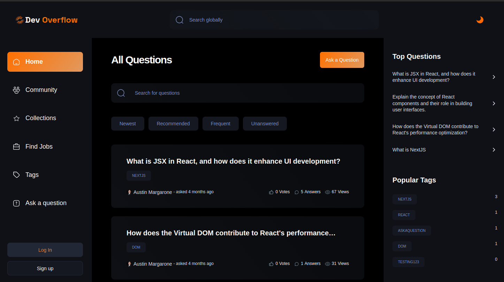

# Dev Overflow

## Description

Discover DevFlow, your go-to platform inspired by Stack Overflow, designed for seamless collaboration and knowledge exchange among developers. Ask questions, share insights, and innovate together in our vibrant community.

## Table of Contents

- [Dev Overflow](#dev-overflow)
  - [Description](#description)
  - [Table of Contents](#table-of-contents)
  - [Installation](#installation)
  - [Technologies Used](#technologies-used)
  - [Features](#features)
  - [Usage](#usage)
  - [Contributing](#contributing)
  - [License](#license)
  - [Contact](#contact)

## Installation

To set up the project locally, follow these steps:

1. [Clone](https://help.github.com/en/github/creating-cloning-and-archiving-repositories/cloning-a-repository) this repository to your local machine.
2. Install the necessary dependencies by running `npm install` or `yarn install`.
3. npm run dev

## Technologies Used

My Real Developer Portfolio is built using the following technologies:

- NextJS
- TypeScript
- TailwindCSS
- Git & GitHub
- MongoDB
- Mongoose
- Clerk

## Features

- Create a profile
- Ask questions
- Answer questions
- Colaberate and meet developers
- Search for jobs

## Usage

A Stack Overflow inspired web appliaction.

## Contributing

We welcome contributions from the community! To contribute to the project, follow these steps:

1. Fork this repository.
2. Create a new branch (`git checkout -b feature/your-feature-name`).
3. Make your changes and commit them (`git commit -am 'Add new feature'`).
4. Push to the branch (`git push origin feature/your-feature-name`).
5. Create a new Pull Request.

Please review our [Contributing Guidelines](CONTRIBUTING.md) for more details.

## License

This project is licensed under the [License Name]. See the [LICENSE](LICENSE) file for details.

## Contact

For questions or support, please contact Austin Margarone at austin@margarone.dev.
